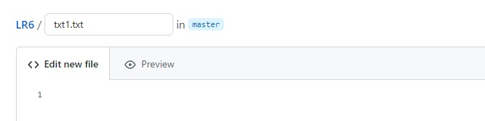
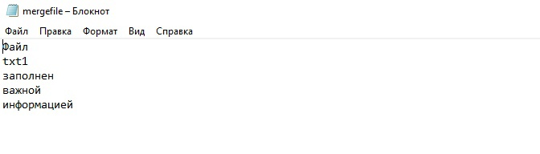

## Лабораторная работа №6

___
**Цель работы**: изучение базовых возможностей системы управления версиями, опыт работы с Git Api, опыт работы с локальным и удаленным репозиторием.
___
**Ход работы**:
1) Создание аккаунта на сайте GitHub.
2) Создание копии в личное хранилище при помощи Fork.
3) Установка Git.
4) Настройка имени пользователя выполняется при помощи `git config --global user.name "username"` и email через команду `git config --global user.email example@mail.ru` (см. Рис.1)
 

*Рис.1. Настройка клиента git*

5) Клонирование личного удалённого репозитория на компьютер выполняется с помощью команды `git clone` и ссылка на репозиторий (см. Рис.2) 

 

*Рис.2. Клонирование личного удалённого репозитория*

6) Добавление нового файла через интерфейс GitHub (см. Рис.3).  
Изменения в локальный репозиторий подтягиваются командой `git pull` (см. Рис.4). 

*Рис.3. Добавление файла*

*Рис.4. Использование команды git pull*

7) Далее работа выполняется локально. Чтобы получить историю операций для каждой из веток, необходимо воспользоваться `git log` (см. Рис.5, Рис. 6). 

*Рис.5. История операций для ветки master*

*Рис.6. История операций для ветки branch1*

Смена ветки осуществляется с помощью `git checkout` (см. Рис.7).

*Рис.7. Смена ветки*

8) Для просмотра последних изменений необходима команда `git show`. Используем её на каждой ветке (см. Рис.8, Рис.9). 

*Рис.8. Последние изменения ветки branch1*

*Рис.9. Последние изменения ветки master*

9) Чтобы выполнить слияние в ветку master, нужно находится в этой ветке и вызвать команду слияния `git merge branch1` (см. Рис.10).

*Рис.10. Слияние в ветку master*

После её использования происходит конфликт.
Для разрешения конфликта часть файла можно удалить вручную (см. Рис.11, Рис.12). 

*Рис.11. Файл с конфликтом*

*Рис.12. Измененный файл*

Выполняется проверка с помощью `git status` (см. Рис.13).

*Рис.13. Использование команды git status*

Для копирования файла в его текущем состоянии используется команда `git add .` или `git add mergefile.txt.` 
После чего необходимо воспользоваться сохранением в виде коммита `git.commit -m "Комментарий"` (см. Рис.14, Рис.15).

*Рис.14. Использование команды git add*

*Рис.15. Сохранение в виде коммита*

10) После успешного слияния веток удаляется побочная branch1 с помощью `git branch -d branch1` (см. Рис.16).

*Рис.16. Удаление ветки*

11) Создание изменений можно выполнить вручную в текстовых файлах (см. Рис.17, Рис.19), не забывая про `git add` и `git.commit` (см. Рис.18, Рис.20).

*Рис.17. Изменение файла*

*Рис.18. Сохранение в коммит*

*Рис.19. Изменение второго файла*

*Рис.20. Сохранение в коммит*

12) Команда `git reset -- hard HEAD` позволяет сделать откат коммита (см. Рис.21).

*Рис.21. Откат последнего коммита*

13) Новая ветка создаётся с помощью команды `git branch`. Переход на эту ветку осуществляется командой `git checkout` (см. Рис.22).

*Рис.22. Создание ветки и переход на нее*

14) Отчёт оформляется в файле README.md при помощи VS Code и markdown. Скриншоты, которые необходимы, располагаются в папке screen, которая находится в папке LR6. Добавление папки происходит с помощью команд `git add` и `git commit` (см. Рис.23, Рис.24).

*Рис.23. Добавление скриншотов*

*Рис.24. Сохранение в коммит*

15) Для получения истории операций в форматированном виде (сокращенный хэш + дата + имя автора + комментарий) требуется команда `git log --pretty=format:'%h - %ad , %an : %s'` (см. Рис.25).

*Рис.25. История операций в форматированном виде*

16) Локальные изменения отправляются в сетевое хранилище GitHub командой `git push`.